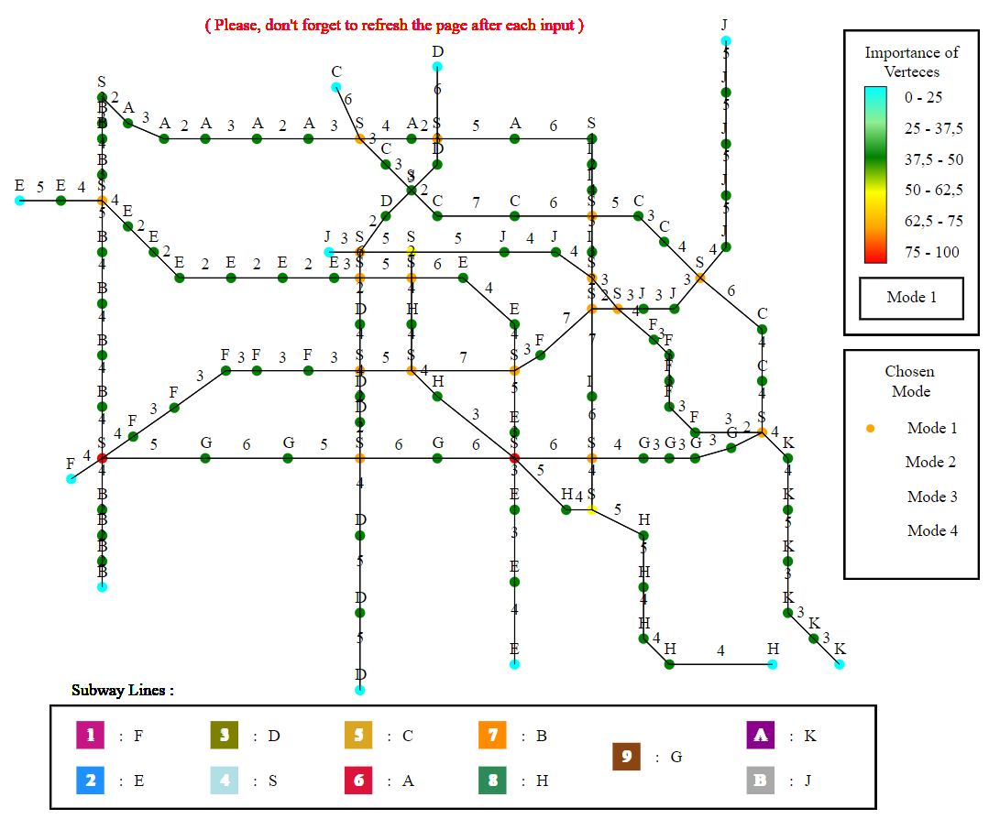
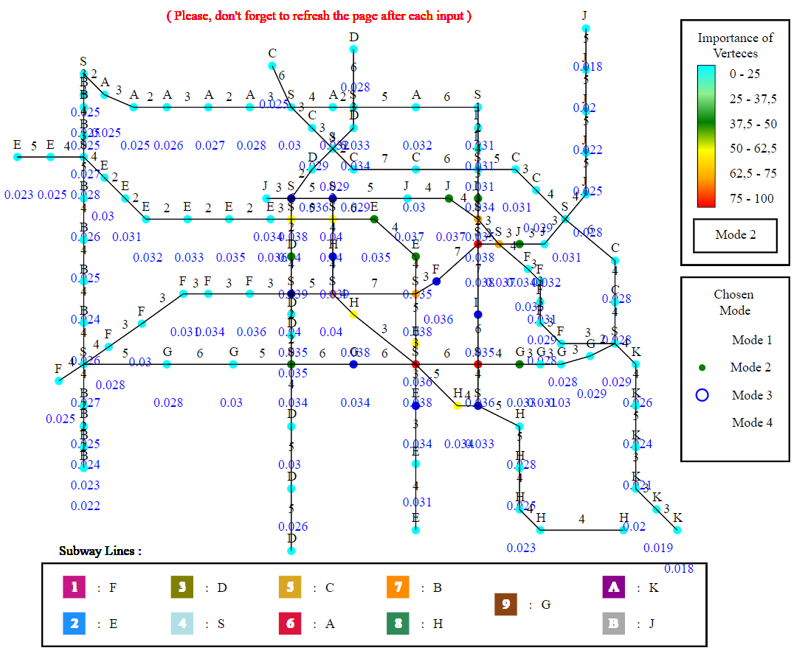
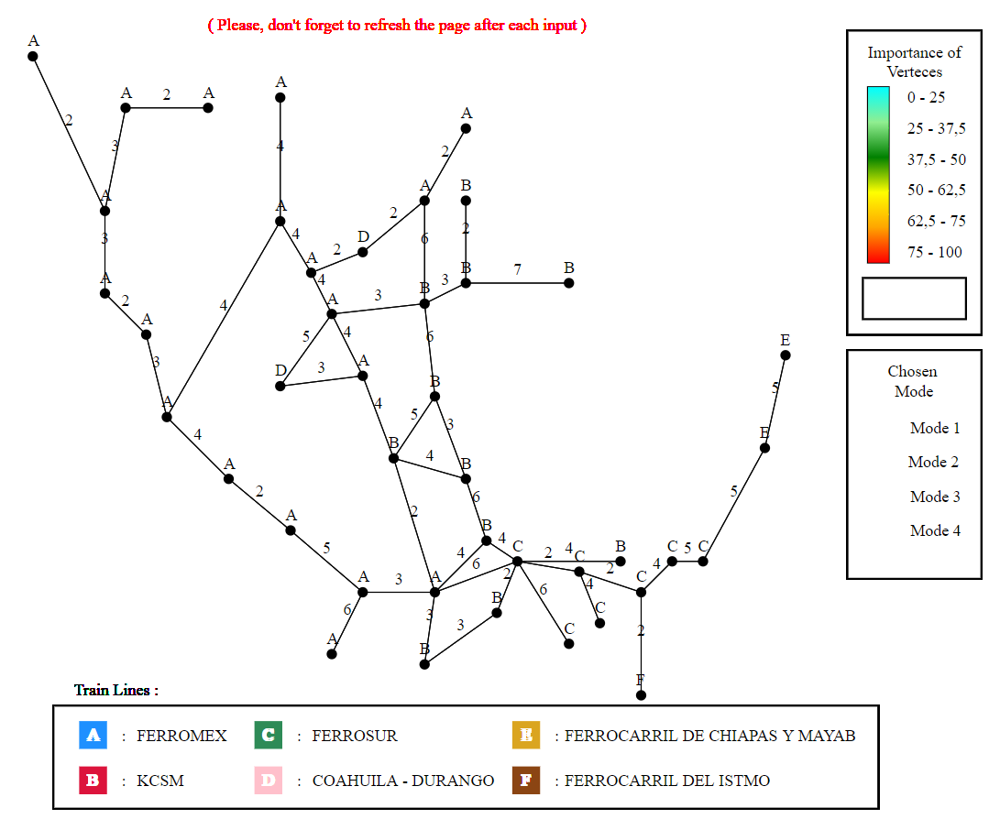

# Algorithm and Graph Theory - Analyze of the Mexico Subway

  

## Purpose

This project is based on **graph theory** to offer an **intelligent mapping application** of the Mexico Subway.

As graph theory establishes links between data and **creates relationships**, it provides artificial intelligence with precise context. It permits the use of AI to solve specific problems.
So, a **railway network** that i will use as an example is the perfect case study

In this example, **each metro station is represented by a verte**x and according to the selected calculation algorithm the metro stations will change **color depending on their importance**

This visualization allows to **quickly analyze a network**. Thus certain algorithms make it possible to **find the stations grouping the most correspondences** (exemple: Degree Centrality Computation)
and others allow to show the station **the most central of the network** (exemple: Betweenness Centrality Computation) or the **differents cluster of traffic** (exemple: Eigenvector Centrality Computation).

## Algorithms Implemented
Technologies used in this project:
1. **Degree centrality**
2. **Eigenvector centrality**
3. **Closeness centrality** (database requests)
4. **Betweenness centrality** (for UI)
5. **Normalization** of all of this algorithms (1. 2. 3. 4.)

### Complexity of algorithms of calcuations

Centrality | Complexity
-----------|------------
Degree     |𝑂(𝑛)
Eigenvector|𝑂(2𝑛log(𝑛))
Closeness  |𝑂(𝑛(𝑛2+2𝑛))
Betweenness|𝑂(𝑛((𝑛2+𝑛)+𝑛2))

## School
This is a School project for the AI and Graph Theory courses
> Grade obtained: **20 / 20**

## Demo with the Mexico Subway network

### Centrality by Degree

### Centrality by Eigenvector with values

## More
To push the project further we can use differents others models to analyze faster the movements of peoples.

### This is an other exemple with the train network of mexico:

